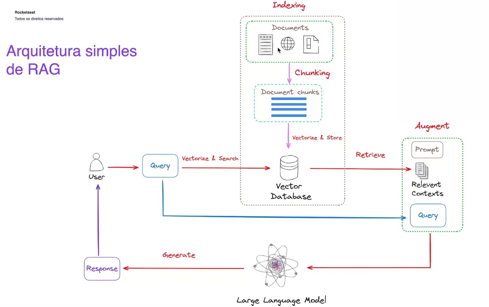

### RAG - Retrieval-Augmented Generation
Retrieval-Augmented Generation (RAG) é uma técnica usada em modelos de linguagem natural que combina a geração de texto com a recuperação de informações de fontes externas. A ideia principal por trás do RAG é melhorar a precisão e a relevância das respostas geradas pelo modelo, fornecendo-lhe acesso a informações atualizadas ou específicas que estão fora do escopo do treinamento original do modelo.

Aqui está como funciona:

1. **Recuperação de Informações (Retrieval):** Quando uma pergunta é feita ao modelo, antes de gerar a resposta, o modelo busca informações relevantes em um banco de dados, documentos ou fontes de conhecimento externas, como a web, bases de dados internas ou um índice predefinido.

2. **Geração (Generation):** Depois de recuperar essas informações, o modelo usa esses dados como contexto adicional para gerar uma resposta mais precisa e informada.

Esse processo permite que o modelo produza respostas que são mais precisas e atualizadas, pois ele não depende apenas do conhecimento armazenado durante seu treinamento, mas também pode consultar fontes externas em tempo real.

RAG é particularmente útil em cenários onde é necessário acessar informações específicas ou atualizadas, como consultas a bases de dados dinâmicas, atendimento ao cliente com FAQs que mudam frequentemente, ou consultas sobre eventos recentes.

## Arquitetura simples de RAG

### Solução simples de RAG
 - Ask Your PDF
 - Chatbase
 - OpenAI com o GPTs

### Libs

#### LangChain
A **LangChain** é uma framework para desenvolver aplicações que utilizam modelos de linguagem de forma estruturada. Ela facilita a criação de pipelines complexos, combinando múltiplos passos de processamento, agentes para decisões dinâmicas, integração com fontes de dados externas, e suporte para manter contexto em conversas. É útil para criar sistemas interativos e personalizados, com ferramentas para debug e monitoramento.

#### LlamaIndex
A **LlamaIndex** é uma biblioteca que facilita a integração de grandes modelos de linguagem com fontes de dados externas. Ela permite criar índices personalizados para acessar dados de forma eficiente, otimizando consultas e respostas geradas por esses modelos. É útil para aplicações que precisam lidar com grandes volumes de dados e querem melhorar a interação com modelos de IA.
