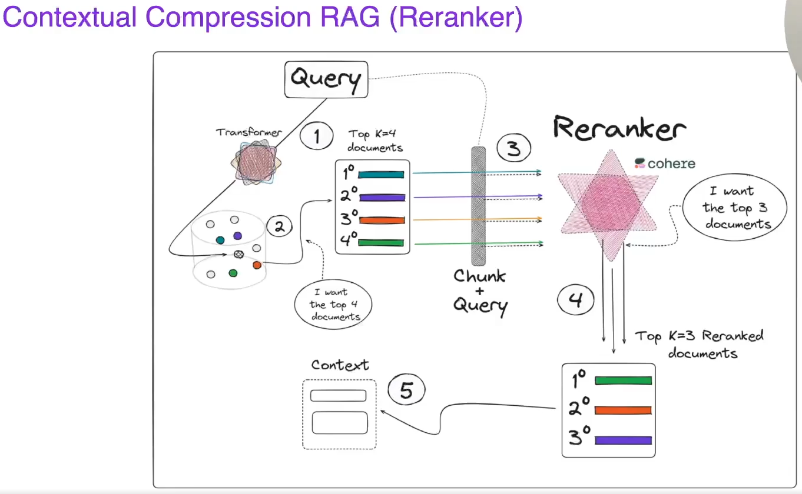
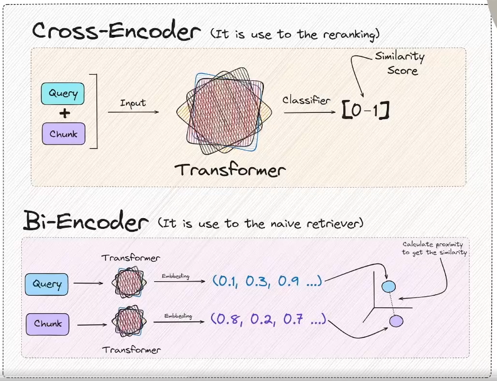

### Contextual Compression RAG (Reranker)

O **Contextual Compression RAG (Reranker)** é uma abordagem avançada em sistemas de Recuperação e Geração (Retrieval-Augmented Generation, ou RAG) que aprimora a relevância das informações recuperadas antes de passá-las para o modelo de geração. Ele utiliza um mecanismo de "reranqueamento" baseado em contexto para comprimir ou selecionar apenas as partes mais relevantes do material recuperado, otimizando a resposta gerada.

Aqui está um detalhamento do conceito:

---

### **1. Contexto: Recuperação e Geração (RAG)**
- **RAG padrão:** Combina um modelo de recuperação (como um mecanismo de busca) com um modelo gerativo (como um LLM).
  1. O modelo de recuperação busca documentos ou informações relevantes de uma base de conhecimento.
  2. O modelo de geração utiliza os dados recuperados para produzir uma resposta.
  
- **Problema:** Nem sempre todos os documentos recuperados são igualmente relevantes. Passar muitos dados irrelevantes pode confundir o modelo gerativo ou gerar respostas mais longas e menos precisas.

---

### **2. O Papel do Reranker**
O **reranker** é uma etapa adicional que classifica os resultados recuperados com base em sua relevância para a consulta ou contexto atual. Ele pode usar:
- Similaridade semântica.
- Relevância em relação ao histórico de diálogo ou consulta.
- Informações fornecidas pelo modelo gerativo sobre o que é necessário.

No **Contextual Compression**, o reranker:
1. Avalia os documentos recuperados.
2. Identifica as partes mais relevantes com base no contexto da consulta.
3. Filtra ou comprime os dados antes de enviá-los ao modelo de geração.

---

### **3. Como Funciona o Contextual Compression**
O mecanismo de compressão pode ser entendido como:
- **Extração de snippets relevantes:** Selecionar apenas frases, sentenças ou parágrafos relevantes de cada documento.
- **Classificação e priorização:** Reordenar os documentos com base na importância.
- **Context-aware ranking:** Considerar o contexto atual da consulta ou o histórico da interação para tomar decisões mais informadas.

Essa compressão não apenas reduz a carga cognitiva do modelo gerativo, mas também melhora a eficiência do sistema como um todo.

---

### **4. Benefícios**
- **Melhor relevância:** Apenas dados altamente relevantes são passados para o modelo gerativo.
- **Eficiência computacional:** Reduz a quantidade de informações processadas, economizando recursos.
- **Respostas mais precisas:** Minimiza ruído e informações irrelevantes na saída.
- **Melhor alinhamento contextual:** Garante que o modelo gerativo compreenda melhor o objetivo da consulta.

---

### **5. Exemplo Prático**
Imagine que você está criando um sistema RAG para responder a perguntas sobre um conjunto de documentos científicos.

1. **Etapa de recuperação:** Um mecanismo de busca retorna 10 documentos relacionados à consulta.
2. **Etapa de reranking/compressão:** O Contextual Compression RAG avalia os documentos e seleciona apenas os parágrafos mais relevantes de 3 desses documentos.
3. **Etapa de geração:** Esses parágrafos são enviados ao modelo gerativo, que utiliza apenas as informações essenciais para criar a resposta.

---

### **6. Tecnologias Associadas**
- **Modelos de reranking:** Como BM25, T5-Reranker ou modelos de aprendizado de classificação.
- **Modelos de linguagem:** Transformers como GPT, T5, ou modelos fine-tunados.
- **Frameworks:** Ferramentas como LangChain, Haystack ou ElasticSearch podem integrar a funcionalidade.

O **Contextual Compression RAG (Reranker)** é particularmente útil em cenários onde a base de dados é vasta e o conteúdo recuperado frequentemente inclui informações irrelevantes. Essa abordagem torna o sistema mais robusto e adaptado ao contexto de uso.

